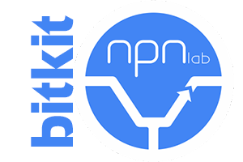
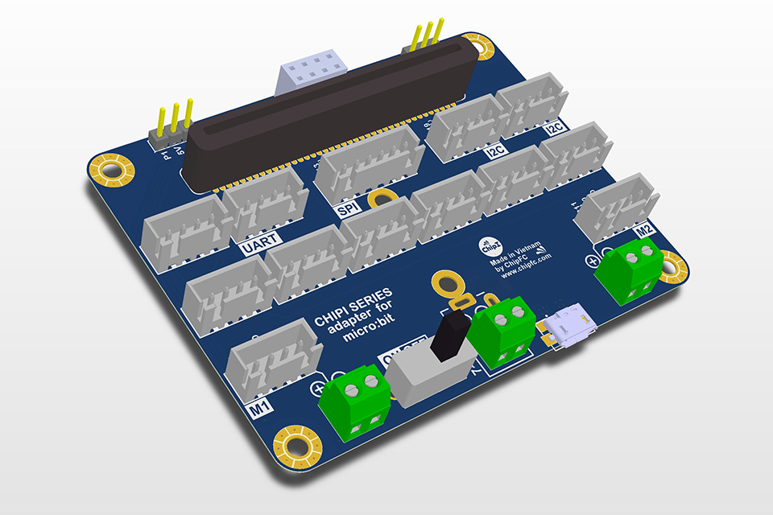

# SmartHomeKit



## Giới thiệu
- Đây là thư viện dành riêng cho bộ kit Microbit Chipi do NPNLab thực hiện.
- Bộ kit này dành cho các chương trình học mở rộng và nâng cao của Microbit để có thể kết nối với các thiết bị ngoại vi phần cứng bên ngoài.





## License

MIT

## Supported targets

* for PXT/microbit
(The metadata above is needed for package search.)

```package
smarthome=github:npnlab-vn/SmartHomeKit
```